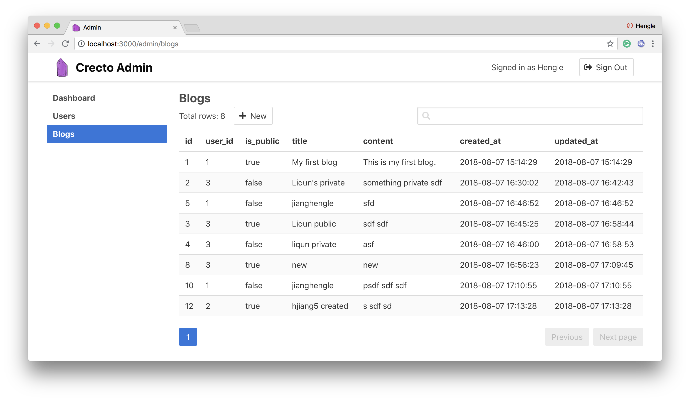

# Crecto Admin

Admin dashboard for Crecto and your database.  Similar to [Rails Admin](https://github.com/sferik/rails_admin) or [Active Admin](https://github.com/activeadmin/activeadmin).

Work in progress.



## Installation

Add this to your application's `shard.yml`:

```yaml
dependencies:
  crecto-admin:
    github: Crecto/crecto-admin
```

## Usage

```crystal
require "crecto-admin"

# define Repo and models

# Initialize admin server
init_admin()

# add your models
admin_resource(User, Repo)
admin_resource(Project, Repo)

# Right now Crystal Admin is using kemal to render views
Kemal.run
```

Take a look at the `examples` directory to find more infomation about the usage.

## Configuration
To modify the behaviour and display of index, form fields and search fields, the following methods can be added to Crecto model classes.

* The attributes shown on the index page:  
  `def self.collection_attributes() : Array(Symbol)`  
  The primary key field will always be shown on the index page.

* The attributes in the create and update forms:  
  `def self.form_attributes() : Array(Symbol | Tuple(Symbol, String) | Tuple(Symbol, String, Array(String) | String))`  
  Each form attribute could be:
  * `Symbol`: field name
  * `Tuple(Symbol, String)`: {field name, field type}
  * `Tuple(Symbol, String, Array(String))`: {field name, field type, options}
  * `Tuple(Symbol, String, String)`: {field name, field type, option}
  
  Field types:
  * `bool`: checkbox
  * `int`: number input, step: "1"
  * `float`: number input, step: "any" or the third item of the tuple
  * `enum`: select from the options (the third item of the tuple)
  * `string`: text input
  * `text`: textarea
  * `password`: password input, the backend will encrypt the raw password into enncrypted password
  * `time`: date time picker
  * `fixed`: readonly input, value as the model value or the option (if the third item of the tuple presents)


* The attributes used when searching:  
  `def self.search_attributes() : Array(Symbol)`  
  The primary key field will always be searched.

The application can also be configured by adding a config block. Add the config block before calling the `init_admin()` method if you want to make a change to the default configuration.
```crystal
CrectoAdmin.config do |config|
  config.option = true
  config.auth = CrectoAdmin::DatabaseAuth
end
```
| Option  | Type | Explanation | Default |
|---|---|---|---|
| auth_enabled | `Bool`  | Enable authentication? | `false`|
| auth | `String?`  | One of the three auth types (see the authentication section below) | `CrectoAdmin::DatabaseAuth`|
| auth_repo | `(Crecto::Repo)?`  | The repo for the database authentication | `nil`|
| auth_model | `(Crecto::Model.class)?`  | The model for the database authentication | `nil`|
| auth_model_identifier | `Symbol?`  | The field to identify a user for the database authentication | `:email`|
| auth_model_password | `Symbol?`  | The field of the password for the database authentication | `:encrypted_password`|
| basic_auth_credentials | `Hash(String, String)?`  | The credentials for the basic authentication | `nil`|
| custom_auth_method | `Proc(String, String, String)?`  | The method for the custom authentication | `nil`|
| items_per_page | `Int32`  | The number of items per page in the index view | `20`|
| app_name | `String`  | The application name in the header | `"Crecto Admin"`|
| app_logo | `String`  | The source of the application logo in the header | `"/crecto.png"`|

## Authentication
Add a config block to define your authentication method. There are three kinds of authentication methods available:

#### Database authentication

```crystal
CrectoAdmin.config do |config|
  config.auth_enabled = true
  config.auth = CrectoAdmin::DatabaseAuth
  config.auth_repo = Repo
  config.auth_model = User
  config.auth_model_identifier = :email
  config.auth_model_password = :encrypted_password
end
```

#### Basic authentication

```crystal
CrectoAdmin.config do |config|
  config.auth_enabled = true
  config.auth = CrectoAdmin::BasicAuth
  config.basic_auth_credentials = {"user1" => "password1", "user2" => "password2"}
end
```

#### Custom authentication
Config the custom auth method. Return a `nil` or emtpy string for not autherized. Return a nonempty string for authorized.

```crystal
CrectoAdmin.config do |config|
  config.auth_enabled = true
  config.auth = CrectoAdmin::CustomAuth
  c.custom_auth_method = ->(user_identifier : String, password : String) {
    return "autherized user"
  }
end
```

## Permission

Permission check will only be enabled if the authentication enabled. By the default, there is no permission check meaning any user signed in could access any models defined in your application. But you could define the custom methods on the model to add model level permission check. The input of each method is the `user : (String | Crecto::Model)?` returned from the authentication. For the database authentication, it is the object of `Crecto::Model`. For the basic authentication, it is the username of the credential. For the custom authentication, it is the `String` returned from the `custom_auth_method`.
* access permission
  ```crystal
  def self.can_access(user) : Bool | Crecto::Repo::Query | Array(Symbol) | Tuple(Crecto::Repo::Query, Array(Symbol))
  ```
  It defines who can access what records on what fields.
  * `true`: the user can access all records on all fields
  * `false`: the user cannot access this model
  * `Crecto::Repo::Query`: the user can the records by the specific query on all fields 
  * `Array(Symbol)`: the user can access all records on the specified fields
  * `Tuple(Crecto::Repo::Query, Array(Symbol))`: the user can access the records by the specific query on the specified fields.  
  Note that this is the base permission for other permissions, which means if the user cannot have the access permission he will not have other permissions if he is granded by other permission methods.
* create permission
  ```crystal
  def self.can_create(user) : Bool | Array(Symbol | Tuple(Symbol, String) | Tuple(Symbol, String, Array(String) | String))
  ```
  It defines who can create a new record by what form attributes.
  * `true`: the user can create a new record
  * `false`: the user cannot create any record
  * `Array(Symbol | Tuple(Symbol, String) | Tuple(Symbol, String, Array(String) | String))`: the user can create a new record by the specified form attributes
  Note that the attributes in the create form will be the intersection of the accessible attribute, the model form attribute and the specified attribute returned from this method
* edit permission
  ```crystal
  def can_edit(user) : Bool | Array(Symbol | Tuple(Symbol, String) | Tuple(Symbol, String, Array(String) | String))
  ```
  It is the instance method which defines who can edit what field on this particular record.
  * `true`: the user can edit this record
  * `false`: the user cannot edit this record
  * `Array(Symbol | Tuple(Symbol, String) | Tuple(Symbol, String, Array(String) | String))`: the user can edit this record on the specfic form attributes
  Note that, similar to the create permission, the attributes in the edit form will be the intersection of the accessible attribute, the model form attribute and the specified attribute returned from this method
* delete permission
  ```crystal
  def can_delete(user) : Bool
  ```
  It is the instance method which defines who can delete this particular record.
  * `true`: the user can delete this record
  * `false`: the user cannot delete this record
  Note that, be default if this method not defined, the user can delete the record as long as he has the edit permission

## Event Hooks

There are six events that users could hook their custom event callbacks. To hook up an event, simply define a instance method on the model. The input of each method is the `user : (String | Crecto::Model)?` returned from the authentication. If the authentication is not enabled, the input is `nil`. These hooks could be used to log actions or even make some version control functions.
```crystal
def before_create(user)
def after_created(user)
def before_update(user)
def after_update(user)
def before_delete(user)
def after_deleted(user)
```

## Development

TODO: Write development instructions here

## Contributing

1. Fork it ( https://github.com/[your-github-name]/CrectoAdmin/fork )
2. Create your feature branch (git checkout -b my-new-feature)
3. Commit your changes (git commit -am 'Add some feature')
4. Push to the branch (git push origin my-new-feature)
5. Create a new Pull Request

## Contributors

- [Nick Franken](https://github.com/fridgerator) - creator, maintainer
